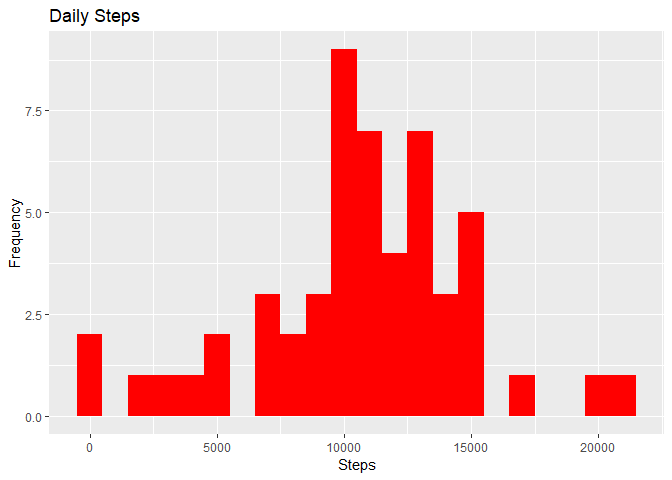
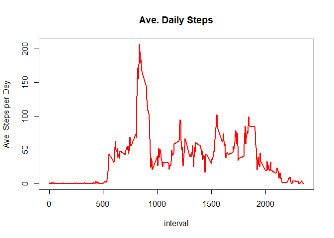
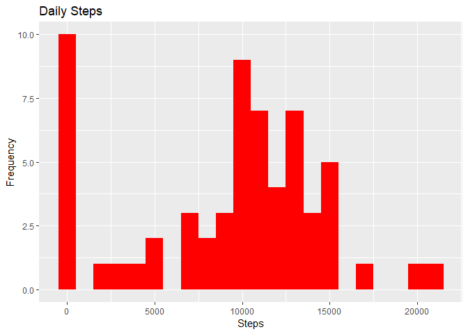
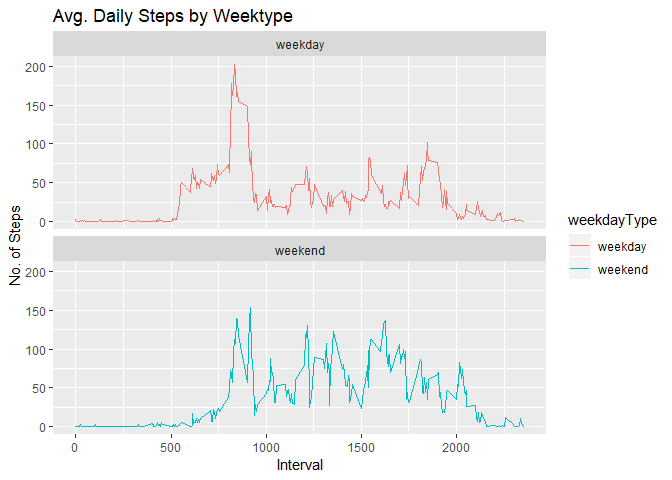

## Loading and preprocessing the data
1. Forked and cloned a repository named RepData_PeerAssessment1 from github.

2. Changed working directory to "C:/Users/kumi/Desktop/RepData_PeerAssessment1"

3. path <-getwd().

4. unzip(zipfile="activity.zip").

5. Read in the data using data.table.


Packages to be used


```r
library(data.table)
library(ggplot2)
library(dplyr)
```

```
## Warning: package 'dplyr' was built under R version 3.5.1
```

```
## 
## Attaching package: 'dplyr'
```

```
## The following objects are masked from 'package:data.table':
## 
##     between, first, last
```

```
## The following objects are masked from 'package:stats':
## 
##     filter, lag
```

```
## The following objects are masked from 'package:base':
## 
##     intersect, setdiff, setequal, union
```

##Read CSV data.


```r
path <-getwd()
unzip(zipfile="activity.zip")
activityDT <-data.table::fread("activity.csv")
dim(activityDT)
```

```
## [1] 17568     3
```

```r
glimpse(activityDT)
```

```
## Observations: 17,568
## Variables: 3
## $ steps    <int> NA, NA, NA, NA, NA, NA, NA, NA, NA, NA, NA, NA, NA, N...
## $ date     <chr> "2012-10-01", "2012-10-01", "2012-10-01", "2012-10-01...
## $ interval <int> 0, 5, 10, 15, 20, 25, 30, 35, 40, 45, 50, 55, 100, 10...
```

```r
sum(is.na(activityDT))
```

```
## [1] 2304
```

```r
mean(is.na(activityDT))
```

```
## [1] 0.04371585
```
The proportion of NAs in the dataset is about 4.4%


## What is mean total number of steps taken per day?

1.Calculate the total number of steps taken per day


```r
TotalSteps <-activityDT[,c(lapply(.SD,sum,na.rm=FALSE)),.SDcols=c("steps"),by=.(date)]
head(TotalSteps)
```

```
##          date steps
## 1: 2012-10-01    NA
## 2: 2012-10-02   126
## 3: 2012-10-03 11352
## 4: 2012-10-04 12116
## 5: 2012-10-05 13294
## 6: 2012-10-06 15420
```

##Histogram of the total number of steps taken each day.


```r
ggplot(TotalSteps,aes(steps))+ geom_histogram(fill="red",binwidth=1000)+labs(x="Steps",y="Frequency")+labs(title="Daily Steps")
```

```
## Warning: Removed 8 rows containing non-finite values (stat_bin).
```

<!-- -->

## Mean and median number of steps taken each day.


```r
MeanSteps <-mean(TotalSteps$steps,na.rm=TRUE)
MeanSteps
```

```
## [1] 10766.19
```

```r
MedianSteps <-median(TotalSteps$steps,na.rm=TRUE)
MedianSteps
```

```
## [1] 10765
```

## What is the average daily activity pattern?

###Time series plot of the average number of steps taken.


```r
IntervalDTAve <-activityDT[,c(lapply(.SD,mean,na.rm=TRUE)),.SDcols=c("steps"),by=.(interval)]
plot(IntervalDTAve$interval,IntervalDTAve$steps,type="l",col="red",lwd=2,xlab="interval",ylab="Ave. Steps per Day",main="Ave. Daily Steps")
```

<!-- -->

##The 5-minute interval that, on average, contains the maximum number of steps.


```r
IntervalDTAve[steps==max(steps),.(maxInterval=interval)]
```

```
##    maxInterval
## 1:         835
```

## Imputing missing values.

###Total number of missing values in the dataset.


```r
sum(is.na(activityDT))
```

```
## [1] 2304
```

```r
#Alternative approach
nrow(activityDT[is.na(steps),])
```

```
## [1] 2304
```

###Code to describe and show a strategy for imputing missing data.
Let's use mean/median imputation here.
Fill in missing values with median of the dataset.


```r
activityDT[is.na(steps),"steps"]<-activityDT[,c(lapply(.SD,median,na.rm=TRUE)),.SDcols=c("steps")]

#Now the new dataset filled with missing values will look like this;
data.table::fwrite(activityDT, file = "activityDT.csv", quote = FALSE)
```


###Histogram of the total number of steps taken each day after missing values are imputed.
Total number of steps taken per day.

```r
TotalSteps <-activityDT[,c(lapply(.SD,sum)),.SDcols=c("steps"),by=.(date)]
ggplot(TotalSteps,aes(steps))+ geom_histogram(fill="red",binwidth=1000)+labs(x="Steps",y="Frequency")+labs(title="Daily Steps")
```

<!-- -->

###Mean and median total number of steps taken per day.


```r
MeanSteps <-mean(TotalSteps$steps,na.rm=TRUE)
MeanSteps
```

```
## [1] 9354.23
```

```r
MedianSteps <-median(TotalSteps$steps,na.rm=TRUE)
MedianSteps
```

```
## [1] 10395
```

## Are there differences in activity patterns between weekdays and weekends?

Panel plot comparing the average number of steps taken per 5-minute interval across weekdays and weekends.

###Create a new factor variable with two levels "weekday" and "weekend".


```r
#Convert date to date class
activityDT$date <-as.Date(activityDT$date)
class(activityDT$date)
```

```
## [1] "Date"
```

```r
#Create a factor variable weekdayType with two levels(weekday,weekend).
activityDT$weekdayType <-as.factor(ifelse(weekdays(activityDT$date)%in% c("Saturday","Sunday"),"weekend","weekday"))
class(activityDT$weekdayType)
```

```
## [1] "factor"
```

##Panel plot (Time series plot)


```r
activityDT[grepl(pattern="Monday|Tuesday|Wednesday|Thursday|Friday",x="Day of week"),"weekday"]<-"weekday"
activityDT[grepl(pattern="Saturday|Sunday",x="Day of Week"),"weekend"]<-"weekend"

activityDT[is.na(steps),"steps"] <-activityDT[,c(lapply(.SD,median,na.rm=TRUE)),.SDcols=c("steps")]
IntervalDT <- activityDT[, c(lapply(.SD, mean, na.rm = TRUE)), .SDcols = c("steps"), by = .(interval, `weekdayType`)] 
ggplot(IntervalDT , aes(x = interval , y = steps, color=`weekdayType`)) + geom_line() + labs(title = "Avg. Daily Steps by Weektype", x = "Interval", y = "No. of Steps") + facet_wrap(~`weekdayType` , ncol = 1, nrow=2)
```

<!-- -->


